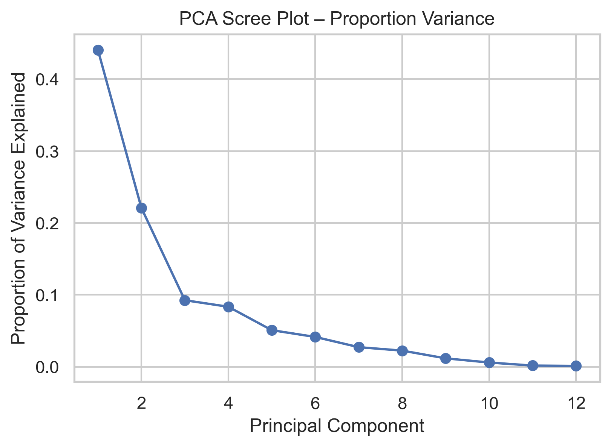
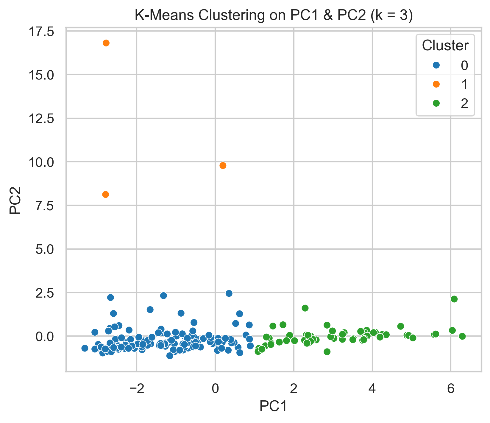
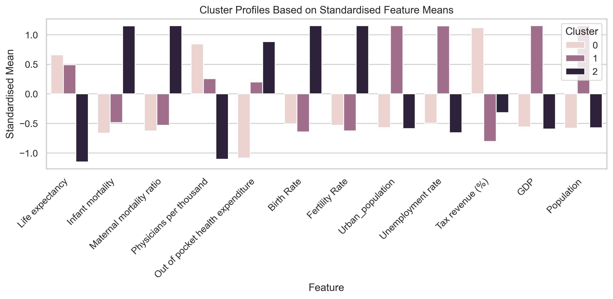
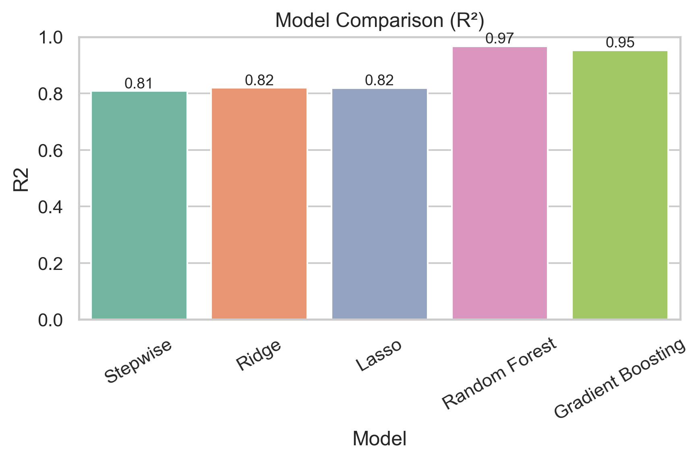
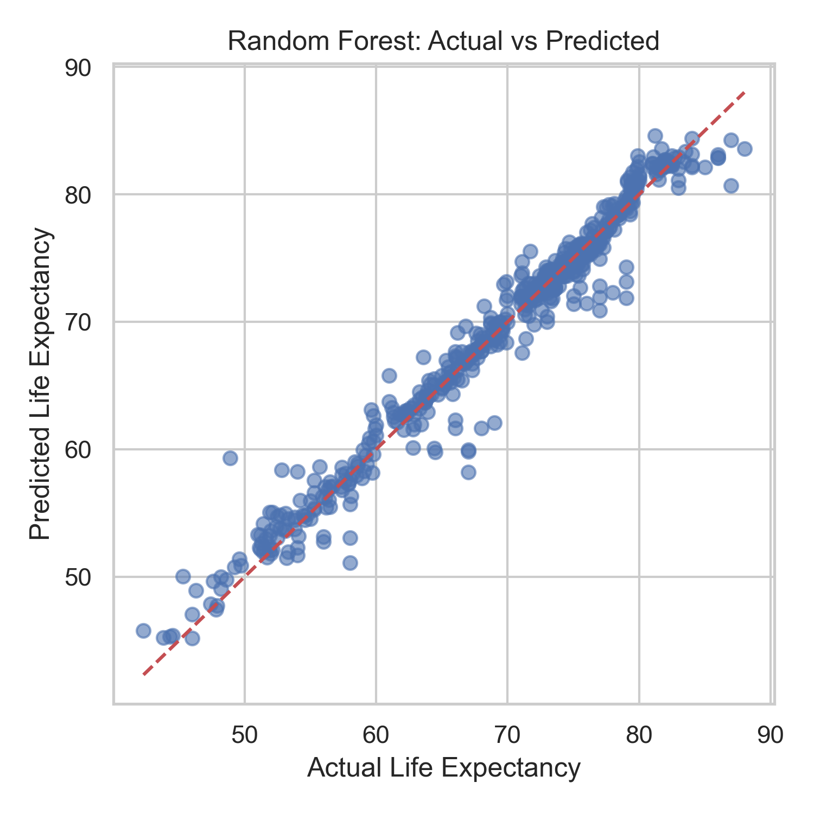
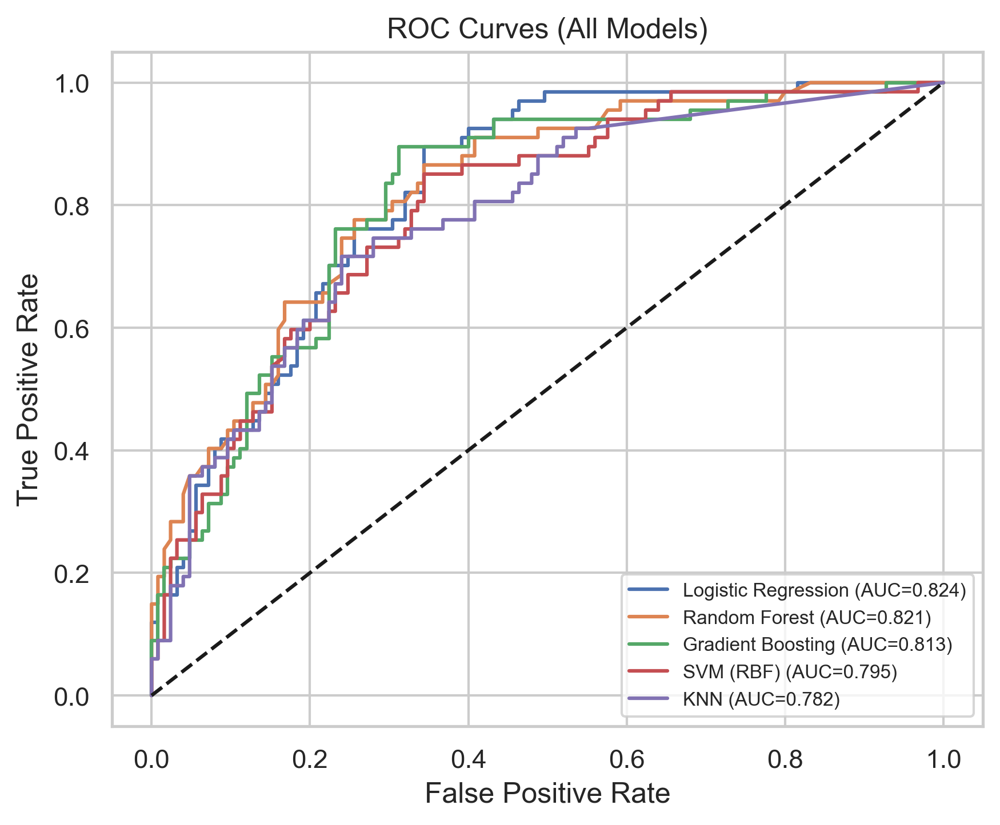
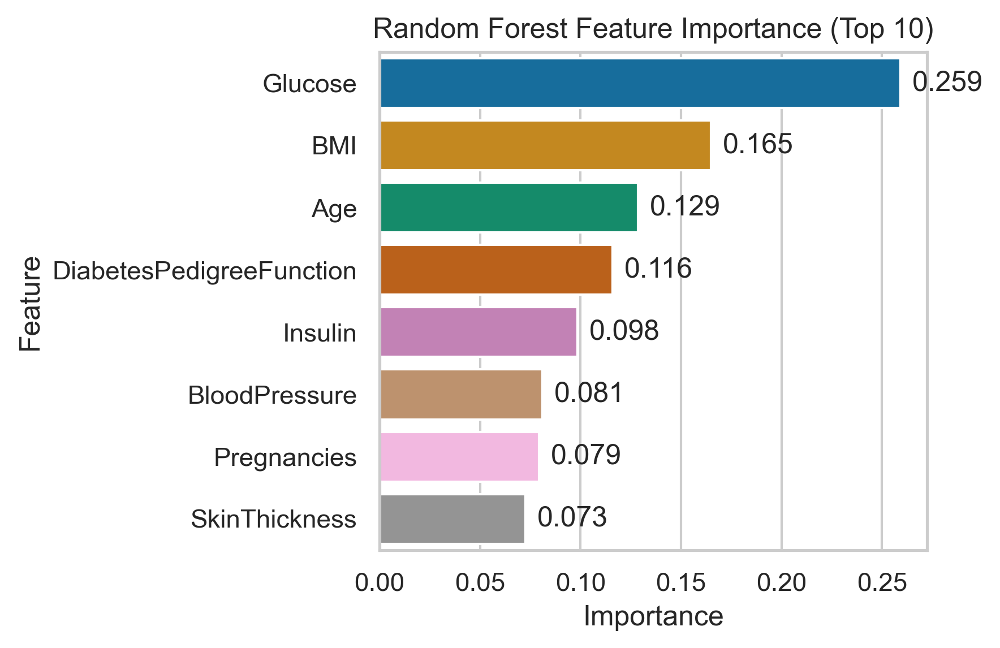

# Healthcare Machine Learning Analysis

A machine learning project exploring healthcare outcomes at both the **global and individual level** using unsupervised learning, regression and classification techniques.

The project combines three analyses: identifying patterns in global healthcare systems, predicting life expectancy, and predicting diabetes risk from clinical indicators.

## Project Objectives

The project addresses three machine learning problems:

1. **Global Healthcare Clustering**  
   Identify groups of countries with similar healthcare, demographic and economic characteristics using PCA and K-Means clustering.

2. **Life Expectancy Prediction**  
   Model life expectancy using health, socioeconomic and demographic indicators and compare linear, regularised and ensemble regression techniques.

3. **Diabetes Risk Prediction**  
   Predict diabetes status using clinical and demographic indicators and compare multiple classification algorithms.

## Datasets

Three open-access datasets were used:

### Global Country Information 2023
Data covering **195 countries** across healthcare, demographic and economic indicators.

Key variables include life expectancy, infant and maternal mortality, physician density, healthcare expenditure, fertility, GDP and population.

### Life Expectancy (WHO)
Country-level longitudinal data containing health outcomes, disease prevalence, healthcare expenditure, education and economic indicators.

**Target:** Life expectancy

### Pima Indians Diabetes
A dataset containing **768 observations** and 8 clinical predictors including glucose, BMI, age, insulin and blood pressure.

**Target:** Diabetes status

## Technologies & Techniques

**Language & Libraries**
- Python
- Pandas
- NumPy
- Matplotlib
- Scikit-learn

**Machine Learning**
- Principal Component Analysis (PCA)
- K-Means Clustering
- Linear & Stepwise Regression
- Ridge Regression
- Lasso Regression
- Random Forest
- Gradient Boosting
- Logistic Regression
- Support Vector Machine (SVM)
- K-Nearest Neighbours (KNN)

**Evaluation**
- Silhouette Score
- RMSE
- R²
- Accuracy
- F1-Score
- ROC-AUC
- Confusion Matrix

## Data Preprocessing

Preprocessing varied by task and included:

- Converting formatted text fields into numeric variables
- Handling missing values using median imputation
- Standardising numerical features using z-score normalisation
- One-hot encoding categorical variables
- Treating biologically implausible zero values as missing in the diabetes dataset
- Using stratified sampling for diabetes classification

## Analysis Overview

### 1. Global Healthcare Clustering

PCA was used to reduce dimensionality and examine the underlying structure of global healthcare and socioeconomic indicators.

The first two principal components explained approximately **66% of total variance**.

K-Means clustering was evaluated using the elbow method and silhouette analysis, resulting in a **three-cluster solution** representing different patterns of healthcare capacity, economic development and demographic scale.

#### PCA and Clustering Results

The PCA scree plot shows how the explained variance is distributed across the principal components, with the first two components accounting for approximately **66% of total variance**.

The countries were then grouped using K-Means clustering with three clusters in the PCA feature space.

Examining the standardised feature means of each cluster highlights differences in healthcare outcomes, demographic characteristics and economic indicators across the three country groups.

### 2. Life Expectancy Prediction

Multiple regression approaches were compared:

- Stepwise Regression
- Ridge Regression
- Lasso Regression
- Random Forest Regression
- Gradient Boosting Regression

Linear and regularised models achieved test R² values of approximately **0.81–0.82**.

Random Forest achieved approximately:

- **RMSE: 1.68 years**
- **R²: 0.97**

Gradient Boosting achieved approximately:

- **RMSE: 2.03 years**
- **R²: 0.95**

Mortality, HIV/AIDS prevalence, education and socioeconomic indicators emerged as important predictors of life expectancy.

> The high ensemble-model performance should be interpreted cautiously because repeated country-year observations were randomly divided between the training and test sets. A country-level split would provide a stricter test of generalisation.

#### Model Performance

The ensemble models substantially outperformed the linear and regularised regression approaches. Random Forest achieved the highest test R² of approximately **0.97**, followed by Gradient Boosting at approximately **0.95**.

The Random Forest predictions closely follow the actual life expectancy values, illustrating the model's strong predictive fit on the test data.

### 3. Diabetes Risk Classification

Five classification algorithms were compared:

- Logistic Regression
- Random Forest
- Gradient Boosting
- Support Vector Machine
- K-Nearest Neighbours

**Logistic Regression achieved the highest ROC-AUC of approximately 0.824**, while **Gradient Boosting achieved the highest F1-score of approximately 0.598**.

Feature importance analysis consistently identified **glucose, BMI and age** among the strongest predictors of diabetes risk.

The results also demonstrate that more complex models do not necessarily outperform simpler models for every prediction problem.

#### Classification Performance

ROC analysis shows that all five classification models performed better than random classification. Logistic Regression achieved the highest ROC-AUC at approximately **0.824**, closely followed by Random Forest and Gradient Boosting.

#### Feature Importance

Random Forest feature importance identified **glucose** as the strongest predictor of diabetes status, followed by BMI, age and the diabetes pedigree function.

## Repository Contents

- `healthcare_machine_learning_analysis.ipynb` — Complete Python implementation covering clustering, regression and classification
- `images/` — Visualisations of key clustering, regression and classification results
- `README.md` — Project overview, methodology and key findings
  
## 🔗 Data Sources

- [Global Country Information 2023](https://www.kaggle.com/datasets/nelgiriyewithana/countries-of-the-world-2023)
- [Life Expectancy (WHO)](https://www.kaggle.com/datasets/kumarajarshi/life-expectancy-who)
- [Pima Indians Diabetes Dataset](https://www.kaggle.com/datasets/jamaltariqcheema/pima-indians-diabetes-dataset)

## Skills Demonstrated

This project demonstrates experience with:

- End-to-end machine learning workflows
- Data cleaning and preprocessing
- Exploratory data analysis
- Dimensionality reduction
- Unsupervised learning
- Regression modelling
- Classification modelling
- Regularisation
- Ensemble learning
- Feature importance analysis
- Model comparison and evaluation
- Interpreting model limitations
